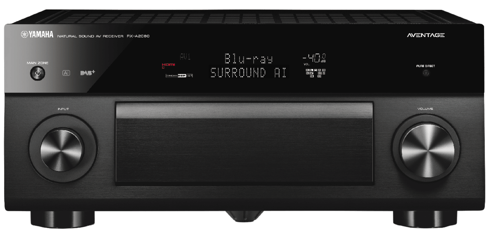

# homebridge-yamaha-receiver

[Homebridge](https://github.com/nfarina/homebridge) plugin for Yamaha Audio Receivers

  

### Requirements

 &nbsp;

- [x] Set static IP for the receiver
- [x] Turn on "Network Stand-By" in the receiver settings
- [x] Check Node Version with `node -v`
- [x] Check Homebridge version with `homebridge -V`

## Support homebridge-yamaha-receiver

**homebridge-yamaha-receiver** is a free plugin under the MIT license. it was developed as a contribution to the homebridge/hoobs community with lots of love and thoughts.
Creating and maintaining Homebridge plugins consume a lot of time and effort and if you would like to share your appreciation, feel free to "Star" or donate.

 
 
